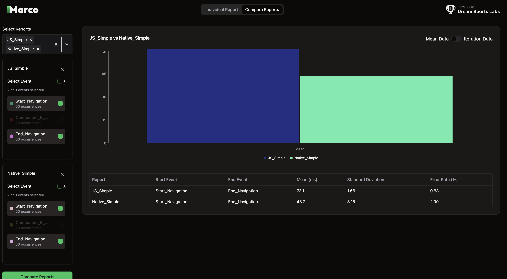
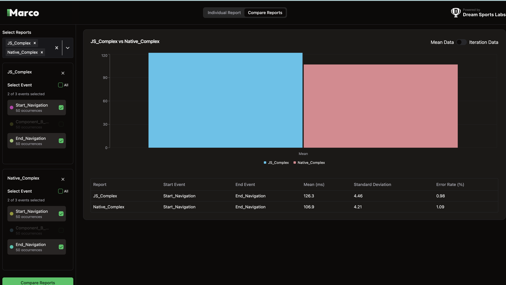

# React Navigation Benchmark

This repository contains benchmarks comparing **`@react-navigation/stack`** [JavaScript-based Stack Navigator](https://reactnavigation.org/docs/stack-navigator) vs **`@react-navigation/native-stack`** [native navigation](https://reactnavigation.org/docs/native-stack-navigator) using the [Marco benchmark tool](https://github.com/dream-sports-labs/marco).
We have measured navigation time between screens.

---
## 📊 Benchmark Details

### 🔍 What We Measured

#### **Navigation Time**

**Start Marker – Button onPress Event:**

* Navigation begins when the button is pressed on **Screen A**.
* The timestamp is captured using a listener on the `onPress` event.
* This timestamp is sent to [`PerformanceTracker.track()`](https://marco.dreamsportslabs.com/api/methods/) with a custom marker name (e.g., `"Start_Navigation"`).

**End Marker – Screen B Render Completion:**

* Navigation is considered complete when **Screen B** is fully rendered and visible.
* We wrap **Screen B** with [`PerformanceTracker`](https://marco.dreamsportslabs.com/api/tracking-screen/) to capture the **onDraw** event, which marks the end of the transition.
* This marks `"End_Navigation"` in the logs.

📌 *These two markers allow Marco to calculate the time taken to complete the navigation between screens.*

---

### 📍 How It’s Measured

We instrumented the navigation flow using **Marco Markers** at two key points:

| Marker Name        | Description                                                |
| ------------------ | ---------------------------------------------------------- |
| `Start_Navigation` | Captured when the navigation button is pressed on Screen A |
| `End_Navigation`   | Captured when Screen B finishes rendering                  |

🧾 **Navigation Time = `End_Navigation` - `Start_Navigation`**

---

## 📂 Benchmark Scenarios

We tested navigation performance from **Screen A** to **Screen B** in two configurations:

### ✅ Simple Screen B

* Contains only a text element.

### ✅ Complex Screen B

Includes multiple interactive UI elements:

* Header with title and navigation type info
* Dark mode toggle
* Search bar and loading indicator
* Scrollable `FlatList` with selectable items
* Stats section for selected items
* A "Go Back" button

| Report Name      | Description                                                     |
| ---------------- | --------------------------------------------------------------- |
| `JS_Simple`      | JS Stack (`@react-navigation/stack`) - Simple Screen            |
| `Native_Simple`  | Native Stack (`@react-navigation/native-stack`) - Simple Screen |
| `JS_Complex`     | JS Stack - Complex Screen                                       |
| `Native_Complex` | Native Stack - Complex Screen                                   |

---
<details>
<summary>📱 Device Details</summary>

These benchmarks were conducted on:

### 🤖 Android (Real Device)
- **Device:** Realme C35 (Low-end)
- **OS:** Android 13
- **RAM:** 4 GB

### 🍏 iOS (Simulator)
- **Device:** iPhone 16 Pro
- **OS Version:** iOS 18.3

</details>


### 📊 Android Benchmark Results (Simple Screens)



---

### 📊 Android Benchmark Results (Complex Screens)



---

<details>
<summary>📦 Setup Instructions</summary>

> **Note**: Make sure you have completed the [Set Up Your Environment](https://reactnative.dev/docs/environment-setup) guide before proceeding.

---

### 🔧 Step 1: Clone Project and Install Dependencies

```sh
git clone https://github.com/dream-sports-labs/react-navigation-benchmark.git
cd react-navigation-benchmark
yarn install
```

---

### 🚀 Step 2: Start Metro

Start the Metro bundler in one terminal:

```sh
# Using npm
npm start

# OR using Yarn
yarn start
```

---

### 📱 Step 3: Build and Run the App

Open a new terminal:

#### ▶️ Android

```sh
npm run android
# OR
yarn android
```

#### 🍏 iOS

First install CocoaPods:

```sh
bundle install
cd ios && bundle exec pod install && cd ..
```

Then run:

```sh
npm run ios
# OR
yarn ios
```

---

### ✏️ Step 4: Modify and Refresh

You can edit `App.tsx` and toggle the `useNativeNavigation` flag to switch between:

- `@react-navigation/stack` (JS-based navigation)
- `@react-navigation/native-stack` (Native stack navigation)

This flag controls which navigator is rendered for benchmarking.

</details>


## 📌 Run Benchmark with Maestro
We are using the Marco tool to mark events and CLI tools provided by Marco to visualize the results.
For more details refer: [Marco Documentation](https://marco.dreamsportslabs.com/)
We use [Maestro](https://maestro.mobile.dev/) for scripting navigation interactions.

### Prerequisite
Ensure [Maestro](https://docs.maestro.dev/) is installed and accessible:
```
maestro -v
```


### 1. Run Benchmark Test Scripts

#### Android

```
# JS Stack
maestro test .maestro/tests/AndroidScript/navigation-benchmark-js.yml

# Native Stack
maestro test .maestro/tests/AndroidScript/navigation-benchmark-native.yml
```

#### iOS

```
# JS Stack
maestro test .maestro/tests/iosScript/navigation-benchmark-js.yml

# Native Stack
maestro test .maestro/tests/iosScript/navigation-benchmark-native.yml
```


### 2. Generate and Visualize Reports
#### Generate Reports

```
yarn marco generate --platform android
yarn marco generate --platform ios
```
> 📁 Reports will be saved in:
> - `marco-reports/android/`
> - `marco-reports/ios/`


#### Visualize Reports
> 🛠️ Before visualization, ensure correct `path` and `reportName` are set in `marco.config.js`.
```
yarn marco visualize --platform android
yarn marco visualize --platform ios
```

---
